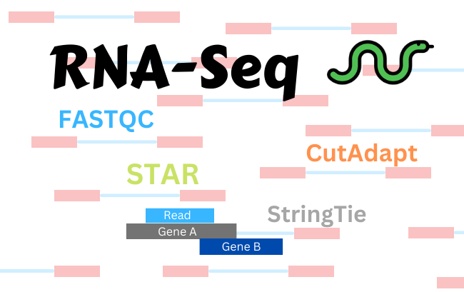

Bulk-RNA-Snakeline
=================================================


## Motivation
With advancements in sequencing technology, a higher number of samples, and greater opportunities for affordability, the production of biological data is massive. As a result, researchers are constantly searching for simpler and more efficient approaches to process and transform large amounts of biological data into information that is both meaningful and reproducible. One approach is to utilize the features and benefits of a workflow engine. Workflow engines are helpful to streamline and automate processing tasks that when done manually, open the door to user bias and mistakes. In order to keep up with increasing data inputs and advancing processing software, the Bioinformatics Core team at the Allen Institute (BiCore), is transitioning towards automated workflows. Specifically, utilizing Snakemake to perform quality assessments, trimming, and mapping on Bulk RNA-Sequencing (Seq) data.

Table of Contents
-----------------
* [Usage](#usage)
* [Required Tools](#Required-Tools)
* [About-Snakeline](#About-Bulk-RNA-Snakeline)
* [Authors and history](#authors-and-history)
* [Pipeline Overview](#Pipeline-Overview)
* [Directory Structure](#Directory-Structure)
* [Acknowledgments](#acknowledgments)
* [References](#references)

## Usage
1. Clone the repository
```bash
git clone 'https://github.com/beagan-svg/Bulk-RNA-Snakeline'
```
2. Create Conda Environement and Load all dependencies to run the pipeline
```bash
conda env create --name snakeline_env -f envs/Bulk-RNA-Snakeline.yml 
```
3. Activate Conda Environment
```
conda activate snakeline_env
```
4. Move RAW Fastq Files into Bulk-RNA-Snakeline Folder
5. Run command to prepare the pipeline by creating directory structure
```bash
python3 setup.py
```
5b. If sample_list.txt is supplied
```bash
python3 setup.py -s <name_of_sample_file>
```
6. Adjust parameters in config.yml 
```bash
config/config.yml
```
7. Run command to execute snakemake and run the workflow
```
snakemake --cores 12 -s <snakefile>
```
7b. (Optional) Using Slurm
```
srun --partition=celltypes --mem=60g --time=24:00:00 snakemake --cores 12 -s main.smk
```
8. Errors: A raised LockException can be encountered. Solution
```
rm .snakemake/locks/*
```
8b. Errors: Directory cannot be locked
```
srun --partition=celltypes --mem=60g --time=24:00:00 snakemake --cores 12 -s main.smk --unlock
```
8c. Errors: Incomplete Run
```
srun --partition=celltypes --mem=60g --time=24:00:00 snakemake --cores 48 -s main.smk --latency-wait 60 --rerun-incomplete
```
Notes. This pipeline will take a long time depending on the data.
## Required Tools  

 * [FastQC 0.11.9](https://www.bioinformatics.babraham.ac.uk/projects/fastqc/) (A quality control tool for high throughput sequence data)

 * [CutAdapt 4.1](https://journal.embnet.org/index.php/embnetjournal/article/view/200/0) (Automates quality  control and adapter trimming of fastq files)

 * [STAR v2.7.1a](https://github.com/alexdobin/STAR) (Spliced aware ultrafast transcript alligner to reference genome)

 * [StringTie 2.2.1](https://ccb.jhu.edu/software/stringtie/) (A fast and highly efficient assembler of RNA-Seq alignments into potential transcripts.)

## About-Bulk-RNA-Snakeline
The Bioinformatics Core team at Allen Institute, currently has a pipeline in place to process raw Bulk RNA-Seq data. However, the existing pipeline requires users to execute a series of custom bash scripts for every step in the workflow. Not only is this time-consuming, but requires additional effort from the user to ensure each script is executed properly with the right parameter adjustments according to the data and its file path. With this method, it is important to understand that any user error may affect downstream analysis and ultimately risk the accuracy of the results. Additionally, users can be challenged with input and output compatibility issues when running multiple scripts. This is when the output files generated from script A fail to be compatible with the inputs into script B because of file formatting and/or versioning. There also needs to be a check on the virtual environment, ensuring every software tool is installed successfully with all the necessary dependencies. In order to minimize the number of manual steps that are required to execute the processing workflow on Bulk RNA-Seq data, the BiCore team is migrating from a basic pipeline written in Unix shell to Snakemake. Snakemake is an easy to use workflow engine that can be used to process data through well defined rules. Each rule contains a set of input and output files, parameters; the computational tasks that will be executed, and optionally a path to the environment. This is a unique feature offered by Snakemake that increases readability by reducing the complexity of the code. Snakemake was designed specifically for Bioinformatics analysis and is the reason it is known as a domain-specific language (DSL). Snakemake was determined as the most suitable workflow engine for the BiCore team because it includes the beneficial properties of portability, readability, reproducibility, scalability, and reusability.  

## Pipeline Overview


## Directory Structure

  
## Authors and History

* Beagan Nguy - Algorithm Design
* Anish Chakka - Project Manager

## Acknowledgments

Allen Institute Bioinformatics Core Team
 
## References
Johannes Köster, Sven Rahmann, Snakemake—a scalable bioinformatics workflow engine, Bioinformatics, Volume 28, Issue 19, 1 October 2012, Pages 2520–2522, https://doi.org/10.1093/bioinformatics/bts480
